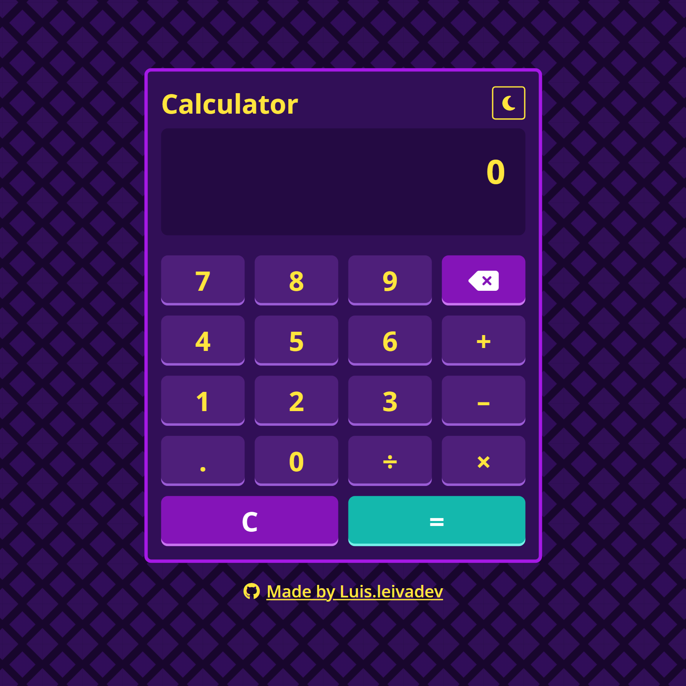

# Calculator App



## [Try the demo!](https://luislev.github.io/calculator/)

## 📃 About the project

Hello there!👋🏼 This is a basic calculator application using HTML, CSS, and JavaScript. It provides a user-friendly interface for performing simple arithmetic operations. Encouraged by [The Odin Project](https://www.theodinproject.com/lessons/foundations-calculator).

## Features

- Basic arithmetic operations like addition, subtraction, multiplication, and division operations.
- Clear button to reset the input and output.
- Displays calculations and results clearly.
- Responsive design for different devices.
- Dark and light theme mode.

## 🔧 Built with

- HTML
- CSS
- JavaScript
- Font Awesome

## Installation

1. Clone the repository to your local machine:

    ``` bash
    git clone https://github.com/Luislev/calculator.git
    ```

2. Open the project folder:

    ``` bash
    cd calculator
    ```

3. Open the `index.html` file in your web browser.

## Contributing

Contributions are welcome! Feel free to submit issues and pull requests🙌🏼.

## License

    This project is Distributed under the MIT License.

## 💯 Acknowledgments

- Inspirations:
  - [michalosman calculator repo](https://github.com/michalosman/calculator)
  - [Frontend Mentor](https://www.frontendmentor.io/challenges/calculator-app-9lteq5N29)
- Icons: [Font Awesome](https://fontawesome.com/)

## 👨🏼‍💻 Author

### Luis Leiva - Software Developer from Panama

<a href="https://www.github.com/luislev" target="_blank" rel="noreferrer"></a>
<a href="https://www.linkedin.com/in/luisleivadev" target="_blank" rel="noreferrer"> </a>
<a href="https://www.x.com/luisleivadev" target="_blank" rel="noreferrer"> </a>
